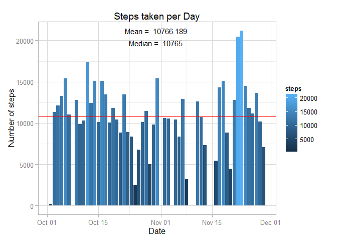

# Reproducible Research: Peer Assessment 1


## Loading and preprocessing the data

1. Reading the data
2. Setting the right format for *date* column


```r
library(dplyr)
```

```
## 
## Attaching package: 'dplyr'
## 
## The following objects are masked from 'package:stats':
## 
##     filter, lag
## 
## The following objects are masked from 'package:base':
## 
##     intersect, setdiff, setequal, union
```

```r
library(ggplot2)
activity_data <- read.csv('activity/activity.csv')
activity_data$date <- as.Date(activity_data$date, format = '%Y-%m-%d')
summary(activity_data)
```

```
##      steps             date               interval     
##  Min.   :  0.00   Min.   :2012-10-01   Min.   :   0.0  
##  1st Qu.:  0.00   1st Qu.:2012-10-16   1st Qu.: 588.8  
##  Median :  0.00   Median :2012-10-31   Median :1177.5  
##  Mean   : 37.38   Mean   :2012-10-31   Mean   :1177.5  
##  3rd Qu.: 12.00   3rd Qu.:2012-11-15   3rd Qu.:1766.2  
##  Max.   :806.00   Max.   :2012-11-30   Max.   :2355.0  
##  NA's   :2304
```
***


## What is mean total number of steps taken per day?

Here the dataset is grouped by date using the **dplyr** package and then the mean number of steps are calculated
per day. The histogram shows the number of steps taken each day and the red horizontal line shows the line across
the mean value of the number of steps taken per day. The histogram is made using the **ggplot** plotting system.
Since the *mean* and *median* values are so close, the horizontal line made on each of those values are not
distinguishable.  

PS: The NA values were not accounted for this analysis.


```r
activity.by.Date <- filter(activity_data, is.na(steps) != TRUE)
activity.by.Date <- group_by(activity.by.Date, date)
activity.by.Date <- summarise(activity.by.Date, steps = mean(steps, na.rm = TRUE))
mean.steps <- mean(activity.by.Date$steps, na.rm = TRUE)
median.steps <- median(activity.by.Date$steps, na.rm = TRUE)
message('Mean value of the steps taken per day is ', mean.steps, ' and median value is ', median.steps)
```

```
## Mean value of the steps taken per day is 37.3825995807128 and median value is 37.3784722222222
```

```r
y.values <- max(activity.by.Date$steps)
# Now to make the plot
ggplot(data = activity.by.Date, aes(x = date, y = steps)) + theme_light() + 
  geom_bar(stat = 'identity', aes(fill = steps)) +
  labs(title = 'Steps taken per Day', x = 'Date', y = 'Number of steps') +
  geom_hline(yintercept = mean.steps, color = "orange") +
  geom_hline(yintercept = median.steps, color = "red") +
  annotate('text', 
           x = mean(activity.by.Date$date), 
           y = c(y.values, y.values-5),
           size = 4, label = c(paste('Mean = ',format(mean.steps, digits = 2, nsmall = 3)),
                               paste('Median = ', format(median.steps, digits = 2, nsmall = 3))))
```

 
***


## What is the average daily activity pattern?

This time the dataset is grouped by *interval* column and average number of steps per interval are computed and
plotted using the same plotting system.  

PS: The NA values were not accounted for this analysis.


```r
activity.by.interval <- filter(activity_data, is.na(steps) != TRUE)
activity.by.interval <- group_by(activity.by.interval, interval)
activity.by.interval <- summarise(activity.by.interval, steps = mean(steps, na.rm = TRUE))
max.interval <- activity.by.interval$interval[which.max(activity.by.interval$steps)]
message('Interval with maximum number of steps ', max.interval)
```

```
## Interval with maximum number of steps 835
```

```r
#Now to make the plot
ggplot(data = activity.by.interval, aes(x = interval, y = steps)) + geom_line(color = 'steelblue') +
  labs(title='Daily activity pattern', x = 'Intervals', y = 'Average steps per interval')
```

 
***


## Imputing missing values

The total number of rows with NA in *steps* are given by:


```r
na.values <- which(is.na(activity_data$steps))
message('Number of rows with NA value of steps are ', length(na.values))
```

```
## Number of rows with NA value of steps are 2304
```

Now the stratergy used to impute the NA values used here is to replace the NAs with the average steps value
corresponding to their interval. The new dataset *activity.impute* is created.


```r
activity.impute <- activity_data
interval.list <- activity.impute$interval[na.values]
steps.list <- activity.by.interval$steps[which(activity.by.interval$interval == interval.list)]
activity.impute$steps[na.values] <- steps.list
summary(activity.impute)
```

```
##      steps             date               interval     
##  Min.   :  0.00   Min.   :2012-10-01   Min.   :   0.0  
##  1st Qu.:  0.00   1st Qu.:2012-10-16   1st Qu.: 588.8  
##  Median :  0.00   Median :2012-10-31   Median :1177.5  
##  Mean   : 37.38   Mean   :2012-10-31   Mean   :1177.5  
##  3rd Qu.: 15.00   3rd Qu.:2012-11-15   3rd Qu.:1766.2  
##  Max.   :806.00   Max.   :2012-11-30   Max.   :2355.0  
##  NA's   :2016
```

Now we create the same historgram as created earlier to see if any difference is made


```r
activity.impute <- filter(activity.impute, is.na(steps) != TRUE)
activity.impute <- group_by(activity.impute, date)
activity.impute <- summarise(activity.impute, steps = mean(steps, na.rm = TRUE))
mean.steps <- mean(activity.impute$steps, na.rm = TRUE)
median.steps <- median(activity.impute$steps, na.rm = TRUE)
message('Mean value of the steps taken per day is ', mean.steps, ' and median value is ', median.steps)
```

```
## Mean value of the steps taken per day is 37.3825995807128 and median value is 37.3805359014675
```

```r
y.values <- max(activity.impute$steps)
# Now to make the plot
ggplot(data = activity.impute, aes(x = date, y = steps)) + theme_light() + 
  geom_bar(stat = 'identity', aes(fill = steps)) +
  labs(title = 'Steps taken per Day', x = 'Date', y = 'Number of steps') +
  geom_hline(yintercept = mean.steps, color = "orange") +
  geom_hline(yintercept = median.steps, color = "red") +
  annotate('text', 
           x = mean(activity.impute$date), 
           y = c(y.values, y.values-5),
           size = 4, label = c(paste('Mean = ',format(mean.steps, digits = 2, nsmall = 3)),
                               paste('Median = ', format(median.steps, digits = 2, nsmall = 3))))
```

 

```r
rm(activity.impute)
```

There does not seems to be any difference made to the plot by imputing values with the above mentioned stratergy
***


## Are there differences in activity patterns between weekdays and weekends?

Here we create another factor variable using the **weekdays()** function to determine the weekday for a date.
After making another factor we plot a time of the 5-minute interval and the avreage steps taken.


```r
weekday <- c('Monday', 'Tuesday', 'Wednesday', 'Thursday', 'Friday')
activity.week <- filter(activity_data, is.na(steps) != TRUE)
activity.week <- mutate(activity.week, weektype = ifelse(weekdays(activity.week$date)%in%weekday, 'weekday', 'weekend'))
activity.week$weektype <- as.factor(activity.week$weektype)
activity.week <- group_by(activity.week, interval, weektype)
activity.week <- summarise(activity.week, steps = mean(steps))
summary(activity.week)
```

```
##     interval         weektype       steps        
##  Min.   :   0.0   weekday:288   Min.   :  0.000  
##  1st Qu.: 588.8   weekend:288   1st Qu.:  1.854  
##  Median :1177.5                 Median : 26.295  
##  Mean   :1177.5                 Mean   : 39.208  
##  3rd Qu.:1766.2                 3rd Qu.: 62.321  
##  Max.   :2355.0                 Max.   :234.103
```

```r
ggplot(data = activity.week, aes(x = interval, y = steps, weektype, color = weektype)) +  geom_line() +
  facet_grid(weektype ~ .) +
  labs(title = 'Daily activity pattern', x = 'Interval', y = 'Average number of steps')
```

 

We can clearly see that the average number of steps taken is higher on weekday than on weekends.  
PS: *weekdays* are counted form *Monday* to *Friday* only, *Sat* & *Sun* are considered weekends.
